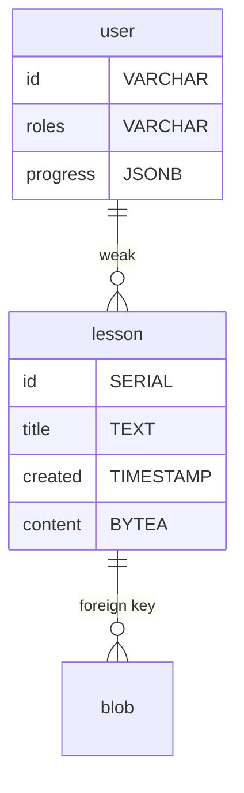

# Edubot

Offline-Mobile-first Learning Website

## Setup

```sh
# start the server on http://localhost
docker-compose up -d
# setup database schema (if first lauch)
docker exec -i $(docker ps -qf name=-postgres-) psql app_db app_user < schema.sql
# deploy a sample dataset
./dataset.sh
```

## Features

- offline chatbot
- offline student courses

## Data Model


