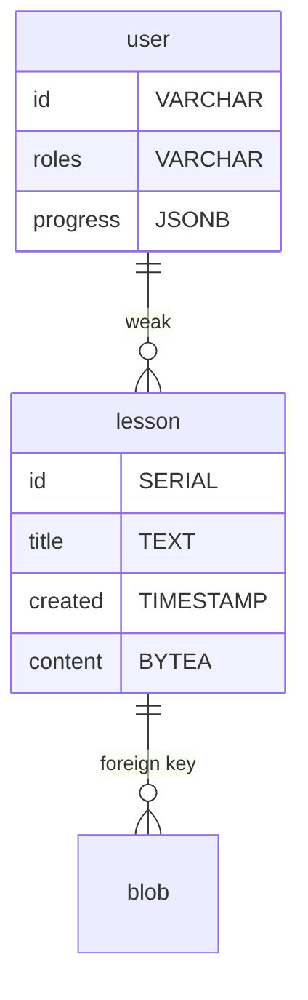

# Edubot

Mobile-first Chatbot-powered vocabulary learning Website

## Setup

```sh
# start the server on http://localhost
docker-compose up -d
# deploy schema if missing lesson table
if curl -s --fail localhost/api/lesson ; then
  docker-compose exec -i postgres psql -f sql/schema.sql
fi
# deploy a example dataset if empty lesson table
if [ $(curl -s localhost/api/lesson) == '[]' ] ; then
  ./dataset.sh
fi
```

## Data Model


