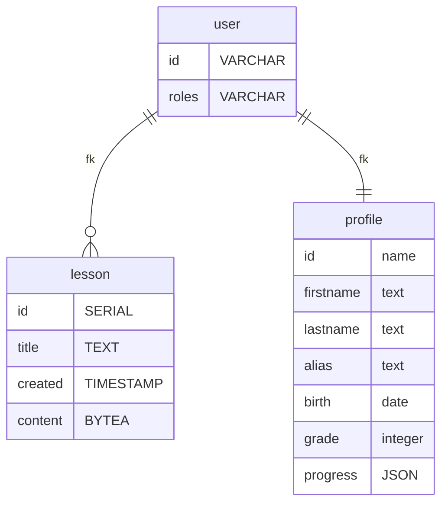

# AnglizBot

Mobile-first Chatbot-powered vocabulary learning Website

## Features

- Chatbot with both Thai Voice and Thai Textual input
- English lesson with exam and rewards
- Unlockable lessons using given rewards

## Setup

Start the project with
```sh
docker-compose up -d
```
Then follow http://localhost for instructions

## Data Model


